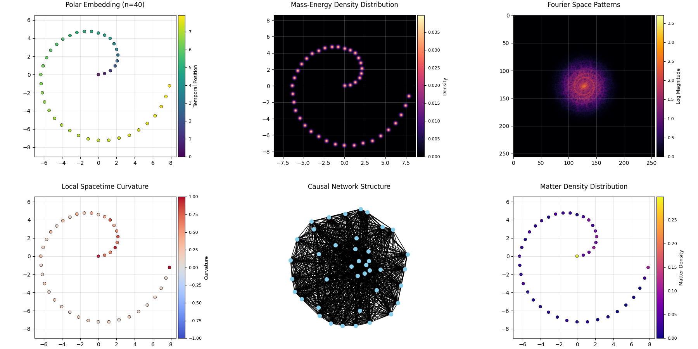

# 🧠 Quantum Golomb Spacetime Simulator

> ## *My Spacetime is Made of Numbers and Poor Decisions*  
>
> ### *Inside the Quantum Golomb Simulator That Accidentally Discovered the Universe*



> *“Some say the universe began with a bang. This one began with `[0, 1]` and a poorly tuned random number generator.”*

---

## 📌 Overview

This project simulates a playful model of spacetime growth inspired by:

- 🧮 **Golomb rulers**
- 🎲 **Quantum fluctuations**
- 🌌 **Curved geometry**
- 🕸 **Causal networks**

While not physically rigorous, the simulator explores how *structure, density, and curvature* can emerge from simple number-theoretic rules—rendered with surprisingly rich visualizations.

---

## 📐 What Is a Quantum Golomb Spacetime?

A **Golomb ruler** is a set of integers (marks) such that all pairwise distances are unique.

In this simulator:

- Each mark is treated as a **discrete event** in time.
- New marks are added via a **temperature-driven growth process**.
- A synthetic **matter–curvature interaction** perturbs new candidates.
- The result is embedded in **polar coordinates**, giving rise to:
  - Mass density fields
  - Local curvature
  - Causal structure
  - Fractal geometry

> ⚠️ This is not quantum gravity—just quantum creativity.

---

## 🌱 Step 1: Birth of the Universe

We begin with two marks:

```python
simulator = QuantumGolombSpacetime(initial_marks=[0, 1])
simulator.quantum_growth(max_marks=40, temperature=0.1)
````

Growth proceeds by probabilistically selecting the next valid integer that maintains the Golomb condition (no repeated distances). The `temperature` parameter controls how chaotic the search is:

- **Low T** → Conservative, stable expansion
- **High T** → Chaotic, entropy-maximizing behavior

---

## 🔀 Step 2: Quantum Decisions (and Other Mistakes)

The system's growth isn't deterministic — it's guided by temperature-controlled randomness.
Low temperatures yield precise, deliberate mark choices; high temperatures allow chaotic, exploratory additions.
Starting from the third mark onward, growth becomes influenced by an emergent interaction:

$$
\text{Potential} \sim \sum_i \frac{\rho_i}{d_i^2 + \varepsilon}
$$

Where:

- \$\rho\_i\$ = local matter density
- \$d\_i\$ = distance to existing mark \$i\$

This interaction biases the selection of new candidates, introducing asymmetry and reinforcing local structure.
Though **curvature** is formally introduced in Step 3, this effect lays the groundwork — subtly shaping how space (and regret) unfold.

---

## 🌀 Step 3: Polar Embedding

Each mark is mapped into 2D using polar coordinates:

$$
x = r \cdot \cos(\theta), \quad y = r \cdot \sin(\theta)
$$

Where:

- \$r\$ = log-scaled radial distance from origin
- \$\theta\$ = angular position around the circle (uniform spacing)

This creates a spiraling spacetime diagram that reveals geometric clustering and local tension.

---

## 🌌 Step 4: Mass Density and Fractal Geometry

The polar embedding is converted into a 2D density map using Gaussian-smoothed binning. We then estimate the **fractal dimension** using box-counting:

$$
D = \lim_{\varepsilon \to 0} \frac{\log N(\varepsilon)}{\log(1/\varepsilon)}
$$

> Example result: `Estimated fractal dimension: 2.181`

This value suggests dimensional emergence or compactified structure.

---

## 🔊 Step 5: FFT of the Density Field

We apply a 2D Fast Fourier Transform (FFT) to the mass density map. This reveals:

- Radial and angular **symmetries**
- Hidden **periodicities**
- Noise or self-similarity signatures

---

## 🧭 Step 6: Causal Network Construction

We build a causal graph where:

- **Nodes** = Events (marks)
- **Edges** = Future-directed links based on angular proximity
- **Weights** encode difficulty of information transfer:

$$
w_{ij} = \frac{\rho_i}{\Delta t_{ij} \cdot (\Delta\theta_{ij} + \delta)}
$$

The graph reflects how events influence each other, with metrics like:

- Causal connection density
- Average path length
- Degree–matter correlation

---

## 📊 Diagnostics: Quantum Physics with a Wink

### 🧬 Quantum Fluctuations

Average deviation from uniform growth is computed as:

```python
Quantum Fluctuation = mean(abs(∆position - 1))
```

Captures jitter introduced by temperature and curvature feedback.

---

### 🌐 Curvature–Matter Feedback

We compute **local curvature** from nearest-neighbor triangles. Higher curvature regions receive more "matter"—mimicking attraction.

---

### ⚖️ Energy Balance (Kind Of)

A toy-model energy proxy is defined as:

$$
\text{Energy} \sim \frac{\text{Total Matter}}{\text{Average Curvature}}
$$

This ratio is tracked across growth to observe pseudo-conservation behavior.

---

## 📈 Visualization Dashboard

The simulator outputs a 6-panel visual summary:

| Panel | Content Description      |
| ----- | ------------------------ |
| 📍    | Polar Embedding (r, θ)   |
| 🌋    | Smoothed Mass Density    |
| 🔊    | FFT of Density Field     |
| 🪐    | Local Curvature Map      |
| 🌐    | Causal Network Diagram   |
| 🌈    | Matter Density per Event |

All panels include colorbars and standardized axis ratios for interpretability.

---

## 🧠 Summary of Findings

While this simulation is fictional and symbolic, it provides:

- A **sandbox for emergent structure** from simple constraints
- A new way to look at **Golomb uniqueness as causal order**
- Feedback loops between **matter, curvature, and event layout**
- Visual metaphors for **dimensional compactification**, **causal flow**, and **quantum foam**

---

## 💡 Philosophical Addendum

> “My universe grew, curved, pulsed, and linked. All from `[0, 1]`.
> Just like ours—chaotic, kind of pretty, and mostly made up.”

You may not find a Theory of Everything, but you might:

- Build intuition for emergent geometry
- Appreciate discrete structures as creative fuel
- Laugh at causality’s LinkedIn behavior

---

## 🛠 Requirements

```bash
pip install numpy matplotlib scipy scikit-learn networkx scikit-image
```

---

## ⚠️ Note

This simulator is designed for **exploration and metaphor**, not physical accuracy.
But it might replace your existential dread with constructive curiosity.

---

## 🧠 Quick Summary: Physics Behind the Simulator

> See full annex: [ANNEX\_PhysicsBehindTheSimulator.md](./ANNEX_PhysicsBehindTheSimulator.md)

1. **Golomb Rulers = Distinct Quantum Events**
   Unique distances prevent overlap — like enforcing unitarity in quantum systems.

2. **Thermal Growth = Quantum Fluctuations**
   Randomized mark addition simulates vacuum noise or inflation-like expansion.

3. **Matter Density = Mass-Energy Field**
   Each mark contributes to a local scalar field influencing future growth.

4. **Numeric Potential = Proto-Curvature**
   Attraction toward denser regions mimics curvature before geometry exists.

5. **Polar Embedding = Emergent Geometry**
   Spatial coordinates are constructed, revealing extrinsic curvature and structure.

6. **Fractal Dimension = Spacetime Texture**
   Dimension $D$ evolves from chaotic >2.0 to smooth \~2.0, reflecting emergence.

7. **Causal Network = Information Flow**
   Directed edges encode relativistic causal relations between events.

8. **Spectral FFT = Hidden Structure**
   Fourier analysis of matter density reveals holographic/spectral patterns.

9. **Curvature vs. Matter = Balance Law**
   A toy energy-like quantity $E = \rho / \langle K \rangle$ remains approximately stable.

10. **Dimensional Emergence**
    Early universe is foamy and noisy; later universe becomes geometric and causal.
